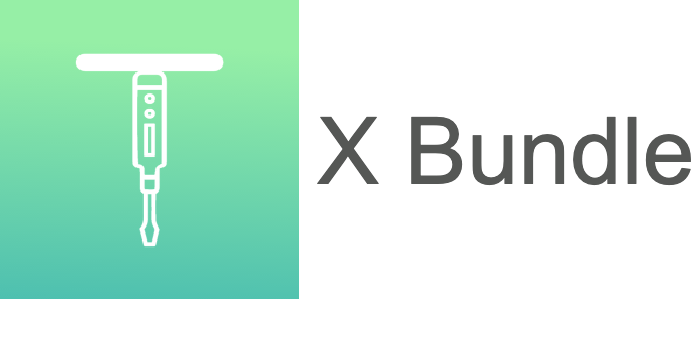

# Bundle React



<div align="center"><strong>Compile SmartPy code locally , Deploy in the Testnet / Local tezos node & interact with your Dapps with a front-end ready environment.</strong></div>

## Improvements :

- Included local testing environment.

- Entry-Points visualizer with Sample invocation.

- Added scripts for invocations and get-storage operation.

- Support of SmartPy Dev mode.

- SmartPy-CLI upgrade and tested for Delphi

## Prerequisites :

- Python 3.x +
- Node v12.x +

> As soon as you clone the repo you are good to go BUILDing your first Dapp in Tezos

## Setup & Run Steps :

1.  `npm install` it will install all your dependencies

2.  `npm run client-install` it will install all the client dependencies i.e in React

### Now you are ready to write your SmartPy Smart Contract

This is how a Smart Contract in SmartPy looks like :

```python
import smartpy as sp

# A typical SmartPy program has the following form:

# A class of contracts
class MyContract(sp.Contract):
    def __init__(self, myParameter1, myParameter2):
        self.init(myParameter1 = myParameter1,
                  myParameter2 = myParameter2)

    # An entry point, i.e., a message receiver
    # (contracts react to messages)
    @sp.entry_point
    def myEntryPoint(self, params):
        sp.verify(self.data.myParameter1 <= 123)
        self.data.myParameter1 += params

# Tests
@sp.add_test(name = "Welcome")
def test():
    # We define a test scenario, together with some outputs and checks
    scenario = sp.test_scenario()

    # We first define a contract and add it to the scenario
    c1 = MyContract(12, 123)
    scenario += c1

    # And call some of its entry points
    scenario += c1.myEntryPoint(12)
    scenario += c1.myEntryPoint(13)
    scenario += c1.myEntryPoint(14)
    scenario += c1.myEntryPoint(50)
    scenario += c1.myEntryPoint(50)
    scenario += c1.myEntryPoint(50).run(valid = False) # this is expected to fail

    # Finally, we check its final storage
    scenario.verify(c1.data.myParameter1 == 151)

    # We can define another contract using the current state of c1
    c2 = MyContract(1, c1.data.myParameter1)
    scenario += c2
    scenario.verify(c2.data.myParameter2 == 151)
```

**Note:** _You don't need to explicitly add the initial storage somewhere just initialize the contract class like a normal python class. We have provided you with a demo.py SmartPy contract._

Once done writing your Smart Contract inside ./contract, You have to configure the compile the config.

## Its time to compile & Deploy

3.  `npm run sync` this is a syncing command. Whenever the compile_config is changed in config.json this command must be executed from the terminal. This command helps the bundle to reconfigure the compilation parameters according to the changes you have made.

4)  `npm run compile` will build the contracts locally inside the folder ./contract_build.

### Editing compile_config :

You have to mention the contract name "demo.py" inside the contract name section.

Note : You have to be specific about file name, otherwise it will throw an error. We have provided an initial config which compiles the ./contract/demo.py

```json
    "compile_config" : {
        "contract_name": "demo.py",
        "class_name": "MyContract(12, 13)"
    },
```

Your code will get compiled and stored in ./contract*build folder and the two files you need to focus on is the *\_compiled.tz & \_\_storage_init.tz

#### contract_build folder will contain the following files :

- contract_build_compiled.tz : Michelson Code of your Smart Contract.

- contract_build_compiled.json : Micheline Code of your Smart Contract.

- contract_build.smlse : an internal expression between SmartPy and SmartML, kept for the record but not directly useful.

- contract_build_storage_init.tz : Micheline representation of the Storage.

- contract_build_types.sp : It specifies the types of the params used in the contract.

5.  `npm run deploy` will deploy your contract with the params respect to your config.json

#### Configuring Deployment Parameters :

Inside the deploy_config section

- First is the Tezos node you want to use , It can be local or any remote node

* Next You can change the contract_code and contract_storage with the ones you want to deploy

- Set the parameters like amount, gas_limit, derivation_path etc

These are the pre-defined config for deployment:

```json
    "deploy_config" : {
        "node" : "https://testnet.tezster.tech",
        "contract_code" : "demo_compiled.tz",
        "contract_storage" : "demo_storage_init.tz",
        "key" : "test_key1",
        "amount" : 10,
        "delegate_address" : "",
        "fee" : 10000,
        "derivation_path" : "",
        "storage_limit" : 10000,
        "gas_limit" : 500000
    },

```

A Tezos **node** allows you deploy contract, make transaction etc.

Other Tezos Nodes :

- [https://tezos-dev.cryptonomic-infra.tech](https://tezos-dev.cryptonomic-infra.tech/)

* [https://carthagenet.SmartPy.io](https://carthagenet.smartpy.io/)

- [http://carthagenet.tezos.cryptium.ch:8732](http://carthagenet.tezos.cryptium.ch:8732/)

Conseil node is used to access conseil services and you need a API Key for that

- [https://conseil-dev.cryptonomic-infra.tech:443/](https://conseil-dev.cryptonomic-infra.tech/)

Use [https://nautilus.cloud](https://nautilus.cloud/) to access API KEY for Conseil node. Use [https://faucet.tzalpha.net/](https://faucet.tzalpha.net/) to obtain keys for any testing. You can use [http://smartpy.io/dev/faucetImporter.html](http://smartpy.io/dev/faucetImporter.html) to activate the keys obtained from faucet.

**Contract Specifications:**

- **contract_code** : It should refer to the Michelson Contract code you want to deploy.

- **contract_storage** : refers to the Michelson representation of the initial storage used for deployment

**Bundle is provided with 6 Keys in the Keystore :**

- Both test_key1.js & test_key2.js are activated in the Alphanet . One can use that or import your own from the faucet and Activate & Reveal using the ConseilJsUtils.

- 4 bootstrap acoounts are provided which can be directly used with our Tezster Suite which provides a local development Blockchain with unique ease of interaction with the Tezos node !

To deploy your contracts in the local tezos blockchain you first need to Setup [Tezster-CLI](https://docs.tezster.tech/tezster-cli) / [Tezster-GUI](https://docs.tezster.tech/)

Once done just change the deploy_config.node : "http://localhost:18731"

Now when you deploy your contract, your contract will be deployed in the local-network and you can play with tezster tools to interact with the contract. To have a better experience give an alias to your contract with :

```sh
tezster add-contract <contract_alias> <contract_address>
```

And you can use all the funtionalities of Tezster-CLI tool.

**\*Note** : \*By Default the tezos-node runs in 18731 for Tezster.\*\*

**Remaining keys are the contract deployment prams which inchudes :**

- **amount** you want to send to the contract ( in micro Tez ).

* **delegate_address** to whom you want to delegate your contract balance. ( tz1 address )

- **fee** to the baker ( in micro Tez )

* **storage_limit** for the contract ( limits the storage used by the contract )

- **gas_limit** to restrict the actions / operactions to be carried out while deployment.

**And then Run the command `npm run deploy`! Your contract will be Deployed**

6.  `npm run dapp` It will spin-up the Dapp front-end and you are ready to use it. This Bundle is packed up with simple create-react-app. Once you run the command the front-end dev server will start up and you will be redirected to your home page in your default browser.

7)  `npm run test` It will run the whole template of SmartPy code with their scenario based testing. And the test results will be visualised in the teminal.

**This command will also generate a test_build where your test results will be stored.**

All you need is to change the **config.json** file and add up the contract name.

```json
    "test_config": {
        "contract_name": "demo.py",
        "test_name": "MyContract"
    }
```

- `contract_name` : This is the file name of Smart Contract you want to test
- `test_name` : This is the test name that is specified in the SmartPy Code `@sp.add_test(name = "Welcome")`

**`npm run sync` is mandatory whenever your config.json file is changed !**

\*PS: You have to create another file in **_contract_** folder with the Smart-Contract and the tests written in it.\*

8.  `npm run get-entry-points` It will extract the entry-points from you recently compiled code and display in the terminal with a sample invocation which you can reference while invoking an entry-point from your dapp.

```
Type: 'unit'
Name : double
Parameters :
Structure : (Left (Right $PARAM))
Sample  Invocation  : (Left (Right  Unit))
```

Package comes with React Ready front-end , and you are ready to use. Use ConseilJs library to interct with the contract.

Build some Awesome Dapps !

## Future Development

We'll be adding some new set of features like **local testing environment** to provide more flexibitity and usability to this Bundle & More bundles are coming soon , stay tuned!

## License

Licensed under the MIT. See the [LICENSE](https://github.com/Tezsure/Bundle-react/blob/master/LICENSE) file for details.
